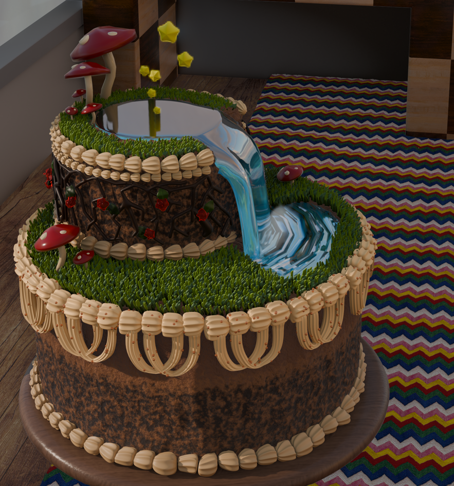
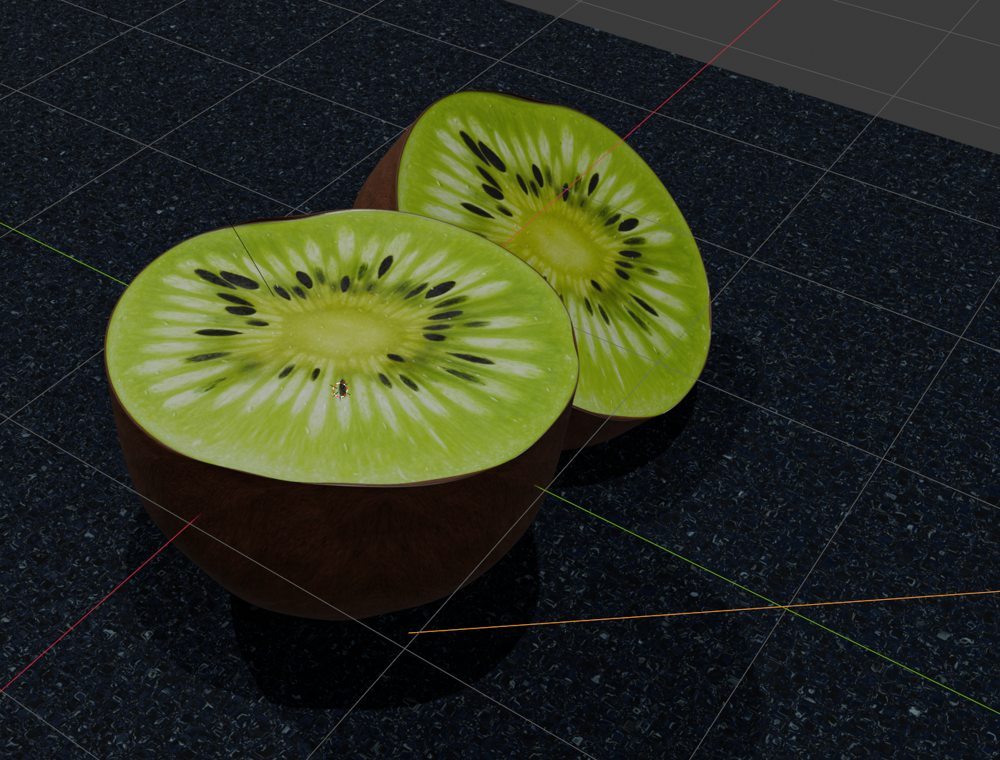
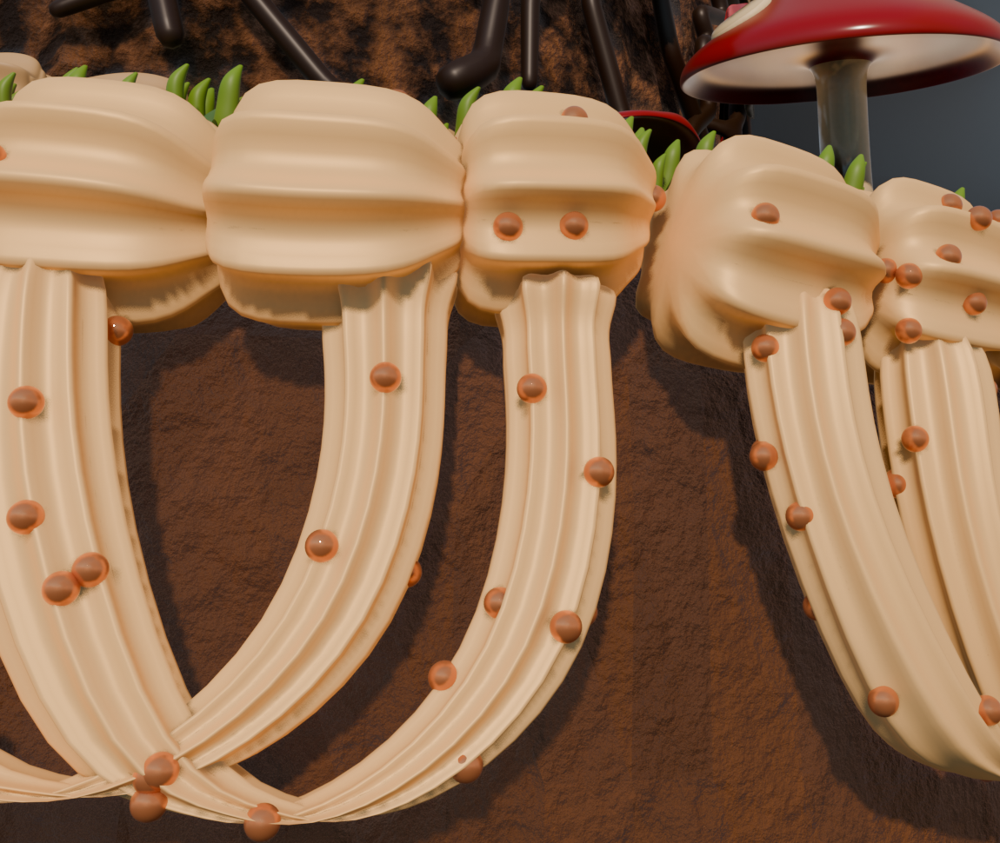
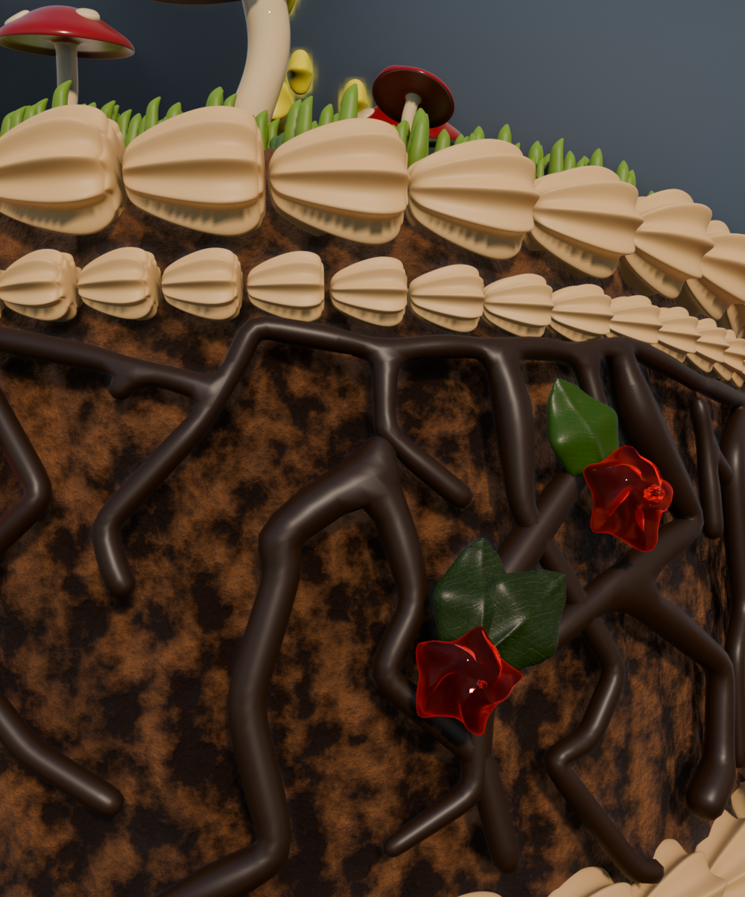
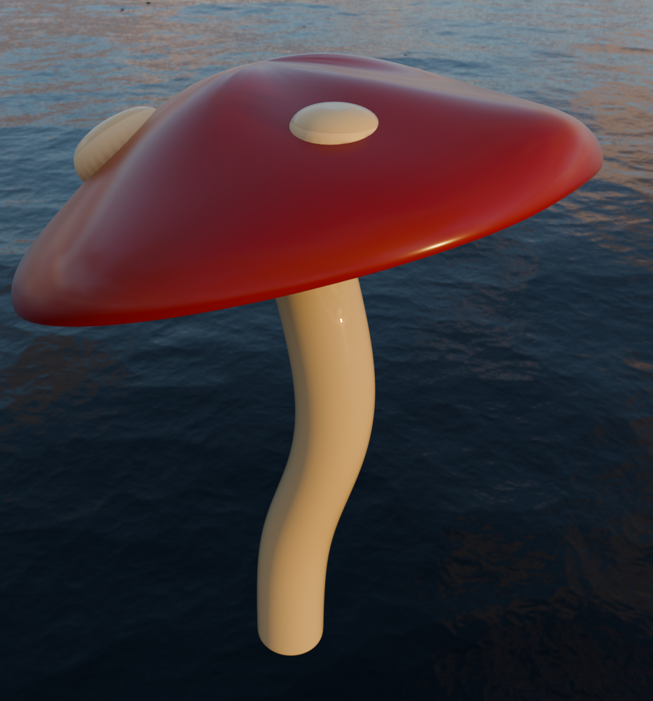
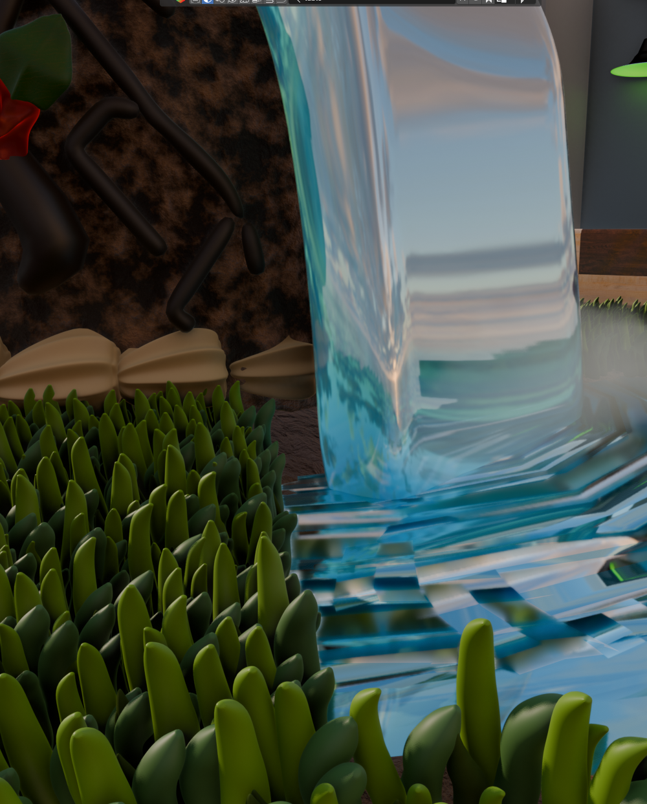
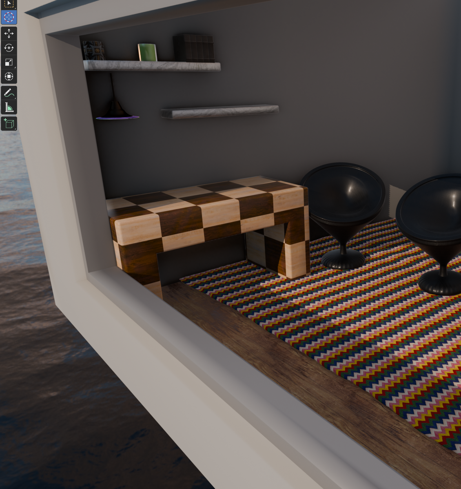

# Kiwi Cake Shop, a Blender 3D Scene

A two-tier fantasy cake set inside a miniature room, modelled and rendered in **Blender** for **Assignment 3, University of Otago**. The project started as a default donut tutorial and grew into a grassy, starlit, waterfall, mushroom, garden cake.

*An early kiwi render, made while testing Blender's image-texture and sculpting tools.*

---

## What This Project Shows

This was a from-scratch 3D modelling, texturing, and lighting project. The goal was a stylised cake scene built almost entirely out of modelling, modifiers, particle systems, and shader work. Techniques I used and learnt along the way:

- **Modelling**: extruding faces to carve out water pools, shaping a single grass blade and a single icing piece as reusable base geometry, sculpting larger forms (chairs, rug, froth) into shape
- **Modifiers**: array-on-a-curve for the piped icing, skin modifier for the chocolate vines, subsurface for added dimension, then sculpting on top to break up uniformity
- **Particle systems**: hair particles for randomly placed and rotated grass (two separate generations for the top and base of the cake), plus rose-gold sprinkles using the same technique
- **Texturing and shading**: BlenderKit textures altered for realism, UV unwrapping the cake base for a continuous pattern, tuning IOR and transmission to get a gelatin-like water look, and using the emissivity slider to make the stars glow
- **Snapping tools**: first used for placing the chocolate vines and gummy roses, then reused across later features
- **Scene and lighting**: a four-wall room with ceiling and floor for full control over lighting and camera, plus an HDRI outside the room for a realistic sky and natural light

---

## The Build

### The Cake
The cake started as the top and bottom tiers. Faces were selected and extruded downwards to make room for water pools, and a cube was extruded, rotated, and pulled down to become the water flowing between them.

The icing was the trickiest part. After working through several tutorials to find a workable array-on-a-curve method, I duplicated a single icing piece, applied an array modifier, and fitted that array to a curve. The first "loopy" icing came out far too uniform, so I added a subsurface modifier for dimension and used the sculpt tool to push, pull, and resize sections until it looked hand-piped.

*Loopy icing with rose-gold sprinkles.*

Hard chocolate "crackle" vines were added with the skin modifier, and gummy roses with food-safe leaves were placed using the snapping tool.

*Chocolate crackle vines and gummy roses.*

### Finishing Touches
Mushrooms and stars came next. The scale tool was handy for bending the mushroom caps, and the stars reused the gummy-flower shape. Glowing stars (modelled as mini LEDs inside thin chocolate shells) were made by adjusting emissivity, and the waterfall froth used a shader-texture combination shaped with a subsurface modifier and sculpting.

*A mushroom, floating above the water.*

*The waterfall and its froth cloud, with grass particles in front.*

### The Scene
The whole cake sits in a miniature room, which gave full control over lighting and camera. The rug uses a subsurface modifier plus the cloth sculpt technique for carpet-like movement, the chairs were modelled from a reference image through several iterations before landing on a smooth leather-and-metal design, and floating shelves with small handmade trinkets fill out the space. One plant pot started glowing unexpectedly during texturing, so it became a lamp.

*The full scene: room, rug, chairs, shelves, and window.*

---

## Honest Critique

A few things I would change with more time:

- The cake felt slightly off centred on the table, and proportionally a bit large, which drew attention away from the small details (like the gummy flowers and textures) that I was proud of
- The window glass blocked most of the incoming light, so the HDRI sky outside barely showed
- The icing could have been joined more naturally, and the window frame could have used more detail
- I would have liked to build a custom air-bubble texture for the icing and reworked the camera and lighting to better hero the cake

Overall I learnt a large number of new techniques for this, many of which I had to research and pick up from scratch. The result came a long way from the initial grey blobs and blocky test objects.

---

## Files
- `cake49.blend` is the full Blender project. Textures are mostly from BlenderKit and can be found by clicking the objects in the file. Unnamed textures are fully original; named ones are BlenderKit imports.

## Asset Licences
Textures used are from BlenderKit under RF and CC0 licences, which BlenderKit states are available for commercial use (https://www.blenderkit.com/docs/licenses/). The original modelling, scene assembly, and final renders are my own work.

## Tools
Blender (modelling, sculpting, particle systems, shading, rendering), BlenderKit
